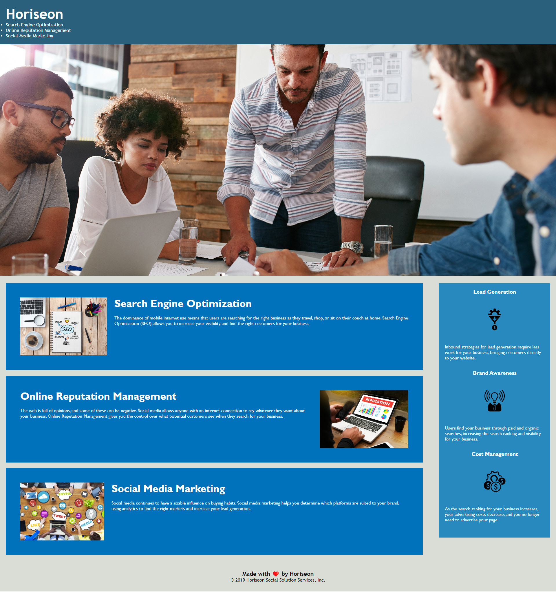

This challenge is to refactor an existing website, which means to modify a website without changing its original function and to add accessibility features.

## Usage

  

Heriseon is a website with accessibility features, such as semantic HTML elements, logical HTML features, image and icon elements contain accessible `alt` attributes.

## User Story

AS A marketing agency
I WANT a codebase that follows accessibility standards
SO THAT our own site is optimized for search engines.

## Credits

edX bootcamp
